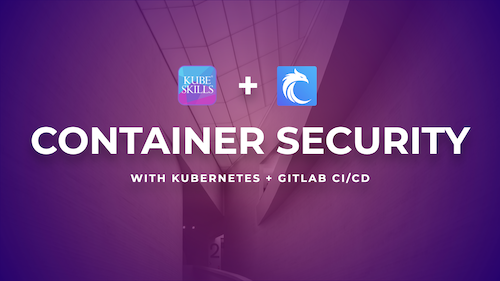

# Container Security with Kubernetes & GitLab

### Who Are You?
- **Administrator or Engineer:** You've had at least a year experience building or troubleshooting systems using various tools.
- **Experience with Git:** You know how to clone a repo, fork a repo, create a new branch, commit and push changes, etc.
- **Docker & K8s:** Have a fundamental understanding of how containers work in the context of Docker and Kubernetes. If lacking, [FreeCodeCamp](https://freecodecamp.org) usually have a lot of free tutorials.

## Course Requirements
- **Instance:** You will need access to 3 cloud servers (VMs). One will be used for GitLab and the others will be used for Kubernetes.
- **Terminal:** Terminal access is required for this course, as you'll be running git commands, ssh and kubectl commands.
- **Web Browser:** As we will be accessing the GitLab UI, you'll need to have a web browser to access and configure GitLab
- **Kubectl:** [Kubectl](https://kubernetes.io/docs/reference/kubectl/) is the command-line tool to interface with Kubernetes. You will need `kubectl` and `kubeadm` to install and access Kubernetes.