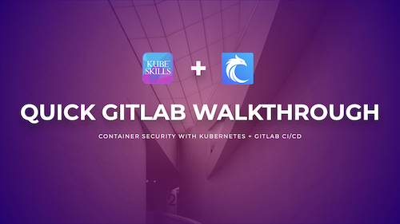

# Quick GitLab Walkthrough

## PIPELINES
- [CI/CD Pipelines](https://docs.gitlab.com/ee/ci/pipelines/)

## RUNNERS
- [All Types of Runners](https://docs.gitlab.com/runner/)
- [Install a Self-Managed GitLab Runner](https://docs.gitlab.com/runner/install/index.html)
- [Kubernetes executor](https://docs.gitlab.com/runner/executors/kubernetes/)

## ARTIFACTS
- [Artifacts](https://docs.gitlab.com/ee/ci/jobs/job_artifacts.html)

## SECURITY & COMPLIANCE
- [SAST](https://docs.gitlab.com/ee/user/application_security/sast/index.html)
- [DAST](https://docs.gitlab.com/ee/user/application_security/dast/)
- [Dependency Scanning](https://docs.gitlab.com/ee/user/application_security/dependency_scanning/)
- [Container Scanning](https://docs.gitlab.com/ee/user/application_security/container_scanning/)
- [Secret Management](https://docs.gitlab.com/ee/user/application_security/secret_detection/index.html)

## DEPLOYMENT
- [Deployment Environments](https://docs.gitlab.com/ee/ci/environments/)
- [Kubernetes with GitLab CI/CD](https://docs.gitlab.com/ee/user/clusters/agent/ci_cd_workflow.html)

## MONITORING
- [Monitor your Applications using GitLab](https://docs.gitlab.com/ee/operations/)

## RELEVANT VIDEOS
- [Get Started with GitLab Application Security](https://youtube.com/playlist?list=PL05JrBw4t0KrUrjDoefSkgZLx5aJYFaF9&si=B8QQXeJXVXPVWzd6)
