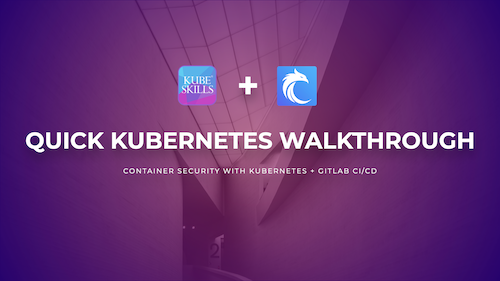
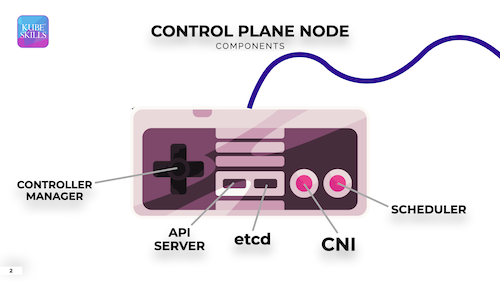
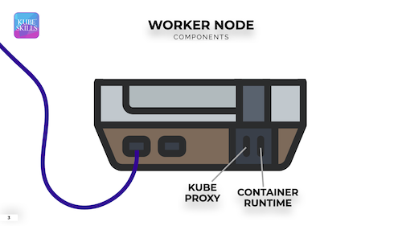

# Container Security with Kubernetes & GitLab
## Quick Kubernetes Walkthrough



### The two main components of Kubernetes:
- Control Plane Node
- Worker Nodes



### Kubernetes from the CLI from `k get po -A -o wide`:
- etcd
- kube-proxy
- kube-controller-manager
- kube-api-server
- kube-scheduler

### Kubernetes YAML
```yaml
apiVersion: v1
kind: Pod
metadata:
  labels:
    run: nginx
  name: nginx
spec:
  containers:
  - image: nginx
    name: nginx
```
- [Declarative Management of Kubernetes Objects](https://kubernetes.io/docs/tasks/manage-kubernetes-objects/declarative-config/)

### Inspecting Container Images
- [nginx official Image - Dockerfile](https://github.com/nginxinc/docker-nginx/blob/d21b4f2d90a1abb712a610678872e804267f4815/mainline/debian/Dockerfile)
- [httpd official image - Dockerfile](https://github.com/docker-library/httpd/blob/3056c115a9f3c2467cc6f67470cfded70c4adc64/2.4/Dockerfile)

## Kubernetes Security Review
- SECURE CONTAINERS:
  - Secure Container Images
  - Use Pod Security Standards (PSS)
  - Using network policies
  - Monitoring and logging
  - Enforce runtime security standards
  - Auditing Tools for Security Incident
- SECURE KUBERNETES
  - Secure the API using RBAC
  - Handling mutation and validation
  - Encrypt secrets
  - Secure node to node traffic
  - Patch node OS Vulnerabilities
  - Patch Kubernetes Vulnerabilities